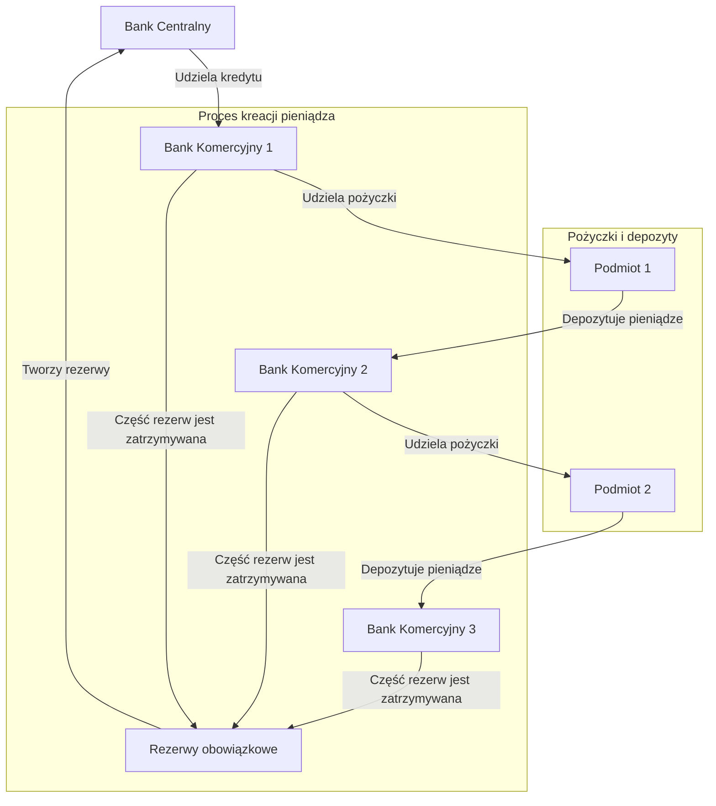

# Funkcje banku centralnego i banków komercyjnych. Proces mnożnikowej kreacji pieniądza.

## Funkcje banków

### Bank centralny

- **Ustanawianie środka płatniczego (pieniądza)** – Bank centralny ma wyłączne prawo do emisji pieniądza w kraju.
- **Prowadzenie polityki pieniężnej** – Kształtowanie podaży pieniądza poprzez:
    - **Operacje otwartego rynku** – Kupno i sprzedaż papierów wartościowych.
    - **Ustalanie stóp procentowych** – Określanie stóp procentowych, które wpływają na koszty kredytów i depozytów.
    - **Ustalanie wysokości rezerw obowiązkowych** – Określanie minimalnych rezerw, które banki komercyjne muszą
      utrzymywać.

### Banki komercyjne

- **Pośrednictwo finansowe** – Zbieranie depozytów od klientów i udzielanie kredytów.
- **Kreacja pieniądza bezgotówkowego** – Tworzenie pieniądza w formie depozytów na kontach bankowych poprzez udzielanie
  kredytów.
- **Regulowanie płatności w imieniu klientów** – Przeprowadzanie transakcji płatniczych i rozliczeniowych.

## Mnożnikowa kreacja pieniądza

1. **Bank centralny udziela kredytu bankowi komercyjnemu.**
2. **Bank komercyjny udziela pożyczki innemu podmiotowi.**
3. **Podmiot deponuje pieniądze w innym banku komercyjnym.**
4. **Część depozytów trafia do banku centralnego jako rezerwy obowiązkowe.**
5. **Proces powtarza się.**

W efekcie tworzy się ciąg, w wyniku którego następuje zwielokrotnienie pierwotnego przyrostu pieniądza banku
centralnego, czyli banki wielokrotnie pożyczają te same pieniądze.

